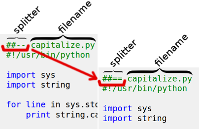

# aardvark

Aardvark.code, flatter is better. 

See: [data.munging.ninja/aardvarkcode](http://data.munging.ninja/aardvarkcode)

Note: on Wed 1st June the splitter pattern was changed from '##--' to '##==' ! 

 

